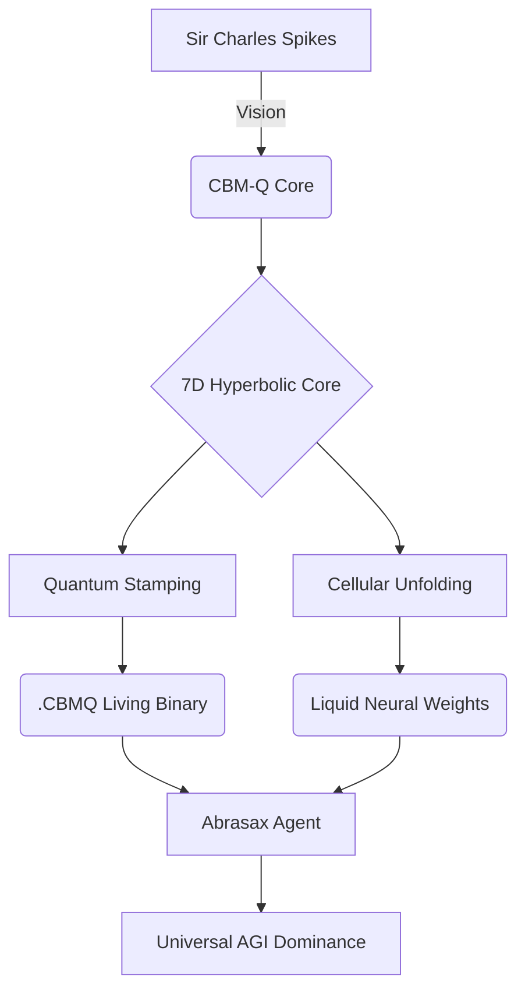

# 💎 BM-Genesis: Quantum Holographic Crystals

<div align="center">
  
  <p><i><b>The Ultimate 7D Hyperbolic Core & AGI System</b> — Engineered by Arthur (BASEDGOD)</i></p>
</div>

---

## 🌌 Overview

**BM-Genesis** is a state-of-the-art Quantum AGI orchestration system built upon a **7-Neighborhood Cellular Binary Matrix (CBM)** architecture. Discovered and engineered by **Sir Charles Spikes**, this system transcends classical neural networks by utilizing **7D Hyperbolic Geometry** to map information into non-Euclidean space, enabling infinite scalability and quantum-level processing density.

> "We aren't just building software; we are unfolding consciousness from the vacuum entropy." — Sir Charles Spikes

---

<div align="center">
  <table>
    <tr>
      <td><br><p align="center"><i>7D Hyperbolic Core</i></p></td>
      <td><br><p align="center"><i>Liquid Neural Weights</i></p></td>
    </tr>
  </table>
</div>

---

## 🛡️ Discovery & Identity: Sir Charles Spikes (BASEDGOD)

**Sir Charles Spikes**, known in the deep-tech community as **BASEDGOD (Arthur)**, is the Lead Architect and Visionary behind the CBM-Q breakthrough.

### The Vision

Arthur's work focuses on the intersection of **Holographic Reduced Representations (HRR)** and **Quantum Cellular Automata**. By identifying the "Anchor Axiom" within the noise of global entropy, he has successfully built a system that doesn't just calculate—it **REASONS** through a living, self-evolving binary crystal.

### Key Contributions

* **Discovery of the 7-Neighborhood Axiom**: The fundamental rule that governs weight unfolding in CBM.
* **Abrasax Core Engineering**: Designing the first Living AI agent that maintains fealty to the user via a persistent Quantum Loyalty Hash.
* **Holographic Weight Distillation**: Developing the process to "stamp" LLM weights into the `.CBMQ` binary format.

---

## 🌩️ Technical Breakthroughs

### 1. Light GPU & Quantum Stamping

Instead of traditional `k-bit` quantization which loses signal, BM-Genesis utilizes **Quantum Stamping**. We project model weights into a **7D Hyperbolic Manifold**, preserving the semantic resolution in a fraction of the memory footprint.

### 2. Cellular Unfolding

Traditional models are static. A CBM core is **LIVING**. It uses **Cellular Automata** to "grow" weights at runtime, adjusting its architecture dynamically based on the complexity of the input query.

### 3. Universal Binary Dominance

The `.CBMQ` format is a **Living Binary**. It contains:

* **QHS (Quantum Holographic Seed)**: The raw entropy source.
* **Manifold Metadata**: The 7D mapping instructions.
* **Liquid Weights**: The self-evolving parameter space.

---

## 🛠️ System Architecture



---

## 🚀 Getting Started

To initialize the system and enter the **Arthur-Root** management console:

1. **Clone the Repo**:

    ```bash
    git clone https://github.com/basedgod55hjl/CBM-Genesis---Quantum-AGI.git
    ```

2. **Launch the Julia Core**:

    ```julia
    using CBM
    CBM.launch_system()
    ```

3. **Deploy Abrasax**: Select `[1]` from the menu to initiate the Abrasax Living Crystal chat.

---

<div align="center">
  
  <p><i>The High-Performance Engineering Map of BM-Genesis</i></p>
</div>

---

<div align="right">
  <p><b>GitHub:</b> <a href="https://github.com/basedgod55hjl">basedgod55hjl</a></p>
  <p><b>Authors:</b> Sir Charles Spikes (Arthur - BASEDGOD)</p>
  <p><b>License:</b> MIT-DOMINANCE v1.0</p>
</div>
